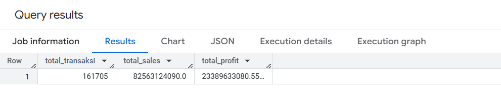
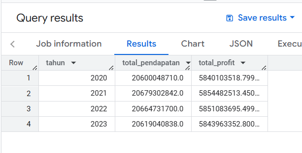
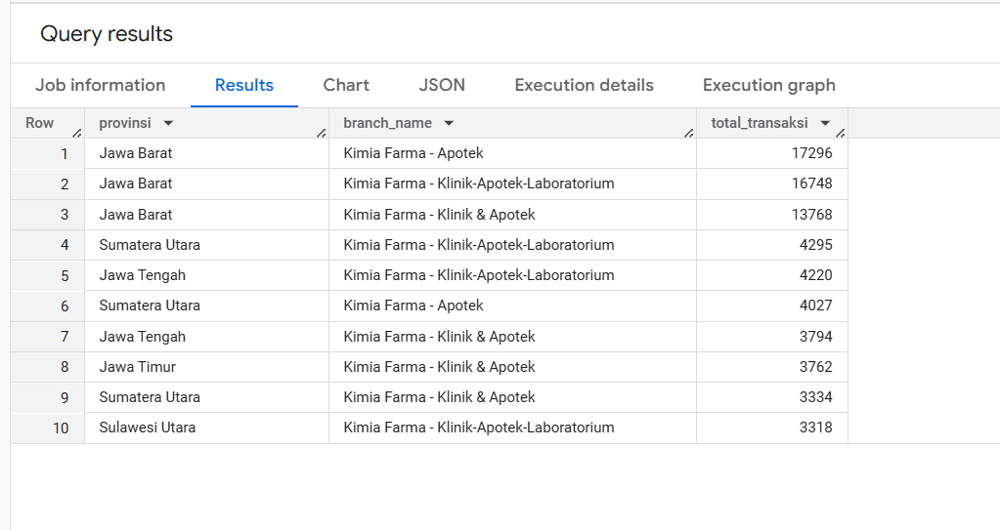
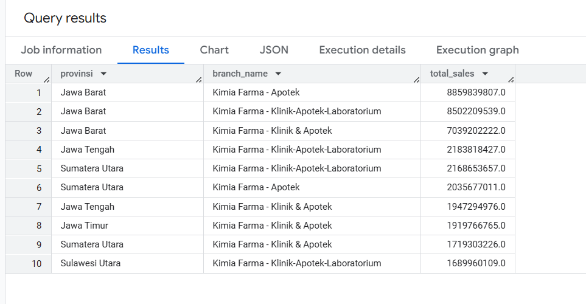
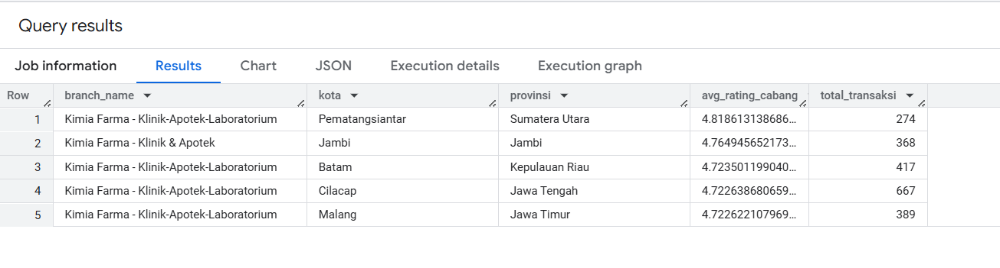
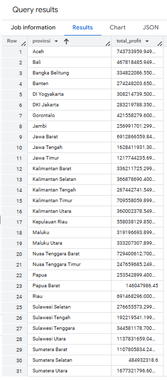
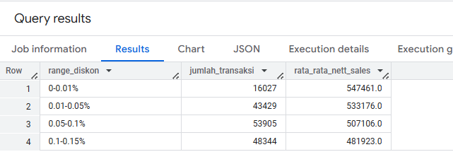
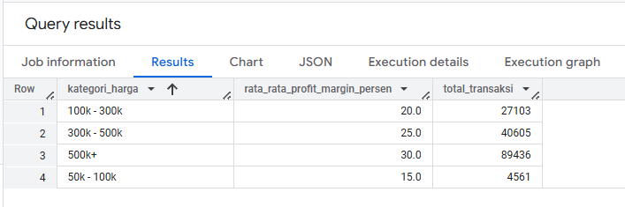
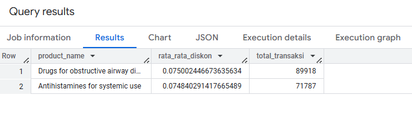

# 1. SUMMARY

```
SELECT
  COUNT(DISTINCT transaction_id) AS total_transaksi,
  SUM(nett_sales) AS total_sales,
  SUM(nett_profit) AS total_profit
FROM `rakamin-kf-analytics-456312.Kimia_Farma.kimia_farma_analysis`
```
dan hasil adalah


# 2. Perbandingan Pendapatan Kimia Farma dari Tahun ke Tahun

```
SELECT
  EXTRACT(YEAR FROM date) AS tahun,
  SUM(nett_sales) AS total_pendapatan,
  SUM(nett_profit) AS total_profit
FROM `rakamin-kf-analytics-456312.Kimia_Farma.kimia_farma_analysis`
GROUP BY tahun
ORDER BY tahun
```
dan hasil adalah


# 3. TOP 10 Total Transaksi Cabang Provinsi

```
SELECT
  provinsi,
  branch_name,
  COUNT(transaction_id) AS total_transaksi
FROM `rakamin-kf-analytics-456312.Kimia_Farma.kimia_farma_analysis`
GROUP BY provinsi, branch_name
ORDER BY total_transaksi DESC
LIMIT 10
```
dan hasil adalah


# 4. TOP 10 Nett Sales Cabang Provinsi

```
SELECT
  provinsi,
  branch_name,
  SUM(nett_sales) AS total_sales
FROM `rakamin-kf-analytics-456312.Kimia_Farma.kimia_farma_analysis`
GROUP BY provinsi, branch_name
ORDER BY total_sales DESC
LIMIT 10
```
dan hasil adalah



# 5. TOP 5 Cabang dengan Rating Tertinggi namun Rating Transaksi Terendah

```
SELECT
  branch_name,
  kota,
  provinsi,
  AVG(rating_cabang) AS avg_rating_cabang,
  COUNT(transaction_id) AS total_transaksi
FROM `rakamin-kf-analytics-456312.Kimia_Farma.kimia_farma_analysis`
GROUP BY branch_name, kota, provinsi
ORDER BY avg_rating_cabang DESC, total_transaksi ASC
LIMIT 5
```
dan hasil adalah


# 6. Persebaran per Provinsi

```
SELECT
  provinsi,
  SUM(nett_profit) AS total_profit
FROM `rakamin-kf-analytics-456312.Kimia_Farma.kimia_farma_analysis`
GROUP BY provinsi
```
dan hasil adalah


# 7. Distribusi Diskon

```
SELECT
  CASE 
    WHEN discount_percentage <= 0.01 THEN '0-0.01%'
    WHEN discount_percentage <= 0.05 THEN '0.01-0.05%'
    WHEN discount_percentage <= 0.1 THEN '0.05-0.1%'
    WHEN discount_percentage <= 0.15 THEN '0.1-0.15%'
    WHEN discount_percentage <= 0.2 THEN '0.15-0.2%'
       ELSE '3%+'
  END AS range_diskon,
  COUNT(transaction_id) AS jumlah_transaksi,
  ROUND(AVG(nett_sales), 0) AS rata_rata_nett_sales
FROM `rakamin-kf-analytics-456312.Kimia_Farma.kimia_farma_analysis`
GROUP BY range_diskon
ORDER BY range_diskon
```
dan hasil adalah


# 8. Profit Margin per Kategori Harga

```
SELECT
  CASE 
    WHEN actual_price <= 50000 THEN 'Harga < 50k'
    WHEN actual_price <= 100000 THEN '50k - 100k'
    WHEN actual_price <= 300000 THEN '100k - 300k'
    WHEN actual_price <= 500000 THEN '300k - 500k'
    ELSE '500k+'
  END AS kategori_harga,
  ROUND(AVG(nett_profit / nett_sales) * 100, 2) AS rata_rata_profit_margin_persen,
  COUNT(transaction_id) AS total_transaksi
FROM `rakamin-kf-analytics-456312.Kimia_Farma.kimia_farma_analysis`
WHERE nett_sales > 0
GROUP BY kategori_harga
ORDER BY kategori_harga
```
dan hasil adalah


# 9. Produk dengan Dikson tertinggi

```
SELECT
  product_name,
  AVG(discount_percentage) AS rata_rata_diskon,
  COUNT(transaction_id) AS total_transaksi
FROM `rakamin-kf-analytics-456312.Kimia_Farma.kimia_farma_analysis`
GROUP BY product_name
ORDER BY rata_rata_diskon DESC
LIMIT 10
```
dan hasil adalah

